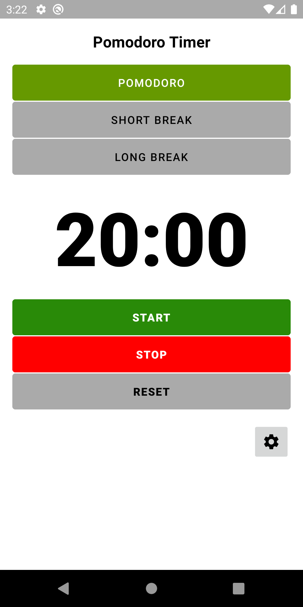
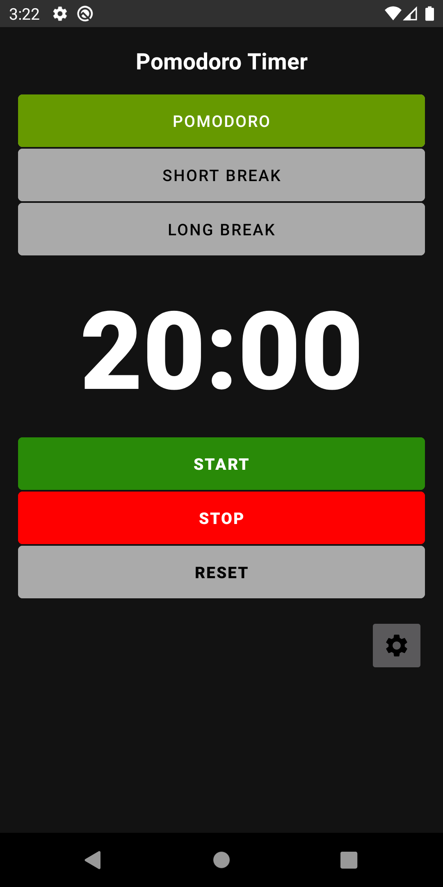

# PomodoroTimer

The Pomodoro Technique is a time management method developed by Francesco Cirillo in the late 1980s. The technique uses a timer to break down work into intervals, traditionally 25 minutes in length, separated by short breaks - 5 minutes.

### Pomodoro Light Theme

### Pomodoro Dark Theme

